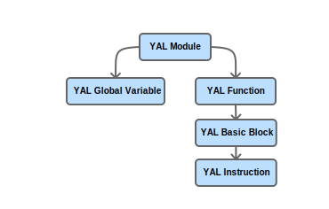
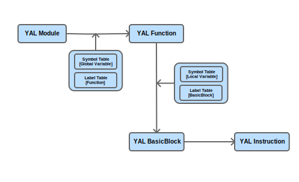

# 2. 项目进展

## 2.1 “断层”阶段

项目的第一阶段，我们叫做断层阶段。

为了快速推进项目进度，我们先简单商榷了我们整个编译器的前后端界线。之后进行两组进行独立的开发。

项目详情在 git commit 记录为 44ce28f6 之前的工作。

此阶段最后的 commit 为：

[USTC-LUG-GITLAB_YAL_commit=44ce28f6](https://git.lug.ustc.edu.cn/csc2020-ustc-yetanotherllvm/compiler/-/tree/44ce28f65636a9429c69f68533548f51ea13cfb0)



前端工作为 SysY Code 转换为 YAL IR。

后端工作为 YAL IR 转换到 Machine Code。

### 2.1.1 前端

前端我们借助 Antlr 作为我们的词法分析工具。

位置在项目目录的 c1recognizer 目录下: [c1recognizer](https://git.lug.ustc.edu.cn/csc2020-ustc-yetanotherllvm/compiler/-/tree/44ce28f65636a9429c69f68533548f51ea13cfb0/c1recognizer)

我们先利用规则书写了词法和文法：[c1recognizer/grammar](https://git.lug.ustc.edu.cn/csc2020-ustc-yetanotherllvm/compiler/-/tree/44ce28f65636a9429c69f68533548f51ea13cfb0/c1recognizer/grammar)

下面展示一部分：

```reStructuredText
lexer grammar C1Lexer;

tokens {
    Comma,
    SemiColon,
    Assign,
    LeftBracket,
    RightBracket,
    LeftBrace,
    RightBrace,
    LeftParen,
    RightParen,
    If,
    Else,
    While,
    Break,
    Continue,
    Return,
    Const,
    Equal,
    NonEqual,
    Negative,
    LogicalAnd,
    LogicalOr,
    Less,
    Greater,
    LessEqual,
    GreaterEqual,
    Plus,
    Minus,
    Multiply,
    Divide,
    Modulo,

    Int,
    Void,

    Identifier,
    IntConst
}

...

Int: 'int';
Void: 'void';

Identifier: [a-zA-Z_] [0-9a-zA-Z_]*;

IntConst: '0' [0-7]*
        | [1-9] [0-9]*
        | '0' [xX] [0-9a-fA-F]+;

LineComment: ('//' | '/\\' ('\r'? '\n') '/') ~[\r\n\\]* ('\\' ('\r'? '\n')? ~[\r\n\\]*)* '\r'? '\n' -> skip;
BlockComment: '/*' .*? '*/' -> skip;

WhiteSpace: [ \t\r\n]+ -> skip;
```

```reStructuredText
parser grammar C1Parser;
options { tokenVocab = C1Lexer; }

compilationUnit: start+;
start: decl | funcdef;
decl: constdecl | vardecl;
constdecl: Const Int constdef(Comma constdef)*SemiColon;
constdef: Identifier (LeftBracket constexp RightBracket)* Assign constinitval; 
// constdef: Identifier (LeftBracket exp RightBracket)* Assign constinitval;
constinitval: constexp 
        |  LeftBrace (constinitval (Comma constinitval)*)? RightBrace;
constexp: addexp;
vardecl: Int vardef(Comma vardef)*SemiColon;
vardef: Identifier (LeftBracket constexp RightBracket)*
        | Identifier (LeftBracket constexp RightBracket)* Assign initval;
initval: exp | LeftBrace (initval (Comma initval)*)? RightBrace;
funcdef: functype Identifier LeftParen funcfparams? RightParen block;
funcfparams: funcfparam (Comma funcfparam)* ; 
funcfparam: Int Identifier (LeftBracket RightBracket (LeftBracket exp RightBracket)*)?; 
functype: Void | Int;
block: LeftBrace blockbody* RightBrace;
blockbody: decl | stmt;
stmt:   lval Assign exp SemiColon 
        | (exp)? SemiColon
        | block 
        | If LeftParen cond RightParen stmt (Else stmt)?
        | While LeftParen cond RightParen stmt
        | Break SemiColon
        | Continue SemiColon
        | Return (exp)? SemiColon;
exp: addexp;
cond: lorexp;
lval:   Identifier (LeftBracket exp RightBracket)*;
primaryexp: LeftParen exp RightParen
        | lval
        | number;
unaryexp: primaryexp
        | Identifier LeftParen (funcrparams)? RightParen
        | unaryop unaryexp;
unaryop: Plus | Minus | Negative;
funcrparams: exp (Comma exp)*;
mulexp: unaryexp 
        | mulexp (Multiply | Divide | Modulo) unaryexp;
addexp: mulexp 
        | addexp (Plus | Minus) mulexp;
relexp: addexp 
        | relexp (Less | Greater | LessEqual | GreaterEqual) addexp;
eqexp: relexp 
        | eqexp (Equal | NonEqual) relexp;
landexp: eqexp 
        | landexp LogicalAnd eqexp;
lorexp: landexp
        | lorexp LogicalOr landexp;
number: IntConst;
```

这样描述了我们的词法和语法，之后借用 Antlr 生产代码进行开发。

### 2.1.2 IR 设计

IRbuilder 和 IRbackend 目录下的代码完成了 IR 的生成。

YAL IR 是基于 LLVM IR 的基础上进行设计和实现的一种 IR 形式，在 LLVM IR 的基础之上，我面为了实现的方便、并为了适应具体的需求，我们做出了相应的设计和改动。我们自上而下的简要介绍IR结构：



1. Module 类：

   在结构层次上，我们最上层的设计为 YAL Module 类，它是我们程序翻译的基本单位，一个 Sysy 程序文件会被翻译成一个 YAL Module 类。（这一设计是为了今后的扩展开发而设计。如果之后考虑多程序编译和链接问题，YAL Module 类会发挥极大的作用。在这里的作用只是用于包装。）

2. Function 类：

   Function 类包含与函数定义或声明有关的所有对象。

3. BasicBlock 类：

   封装了一系列LLVM指令，可通过 begin/end 惯用语进行访问。并且还有一些辅助方法来浏览CFG。Basicblock 是我们划分的基础代码块，目的是方便我们进行代码划分。

4. Instruction 类：

   指令类表示LLVM IR（单个指令）中的计算原子。它具有一些访问高级谓词的方法。

   这也是我们的一个核心类，我们将运算符和运算数的信息存储于此。

我们的 YAL IR 吸收了 LLVM IR 的一个精妙设计：Value & User。这两个类是提供了诸多方便。

如果我们从 Value 类继承，说明我们定义了可以供他人使用的结果；

如果我们从 User 类继承，那么说明这个实体使用了一个或多个的 Value 接口。

这样我们的 Use-Def 或者 Def-Use 访问链都会非常简单。

### 2.1.3 后端设计

这一阶段的后端设计是完成功能测试，为了快速通过功能测试，我们设计的后端从简设计。

基于我们的 [Module - Function - BasicBlock - Instruction] 的 IR 层级设计，我们的后端采用依次向下便利，并在其中整合。



为了适应汇编代码，这里设计了两种数据结构： \<Symbol Table\> 和 \<Label Table\>。前者用于变量声明和定义，后者用于辅助跳转。

## 2.2 “融合”阶段

由于开发初期，我们的前后端是独立开发的，所以在两部分完成的时候，我们将代码 API 进行了调整和整合。

此阶段于完成：

[USTC-LUG-GITLAB_YAL_commit=069c05e3](https://git.lug.ustc.edu.cn/csc2020-ustc-yetanotherllvm/compiler/-/tree/069c05e3ce5886b889a5341272d9f4661532bbe0)

## 2.3 “扁平化”阶段

在最终，我们摘项目进行了整合和简化。

新的目录结构为：

``` bash
├── include
│   ├── antlr
│   └── yal
└── src
    ├── codegen
    ├── irbackend
    ├── irbuilder
    └── recognizer
```

我们的结构如上所示。

- include/antlr 为 antlr 的头文件
- include/yal 为 yal 项目中我们自己编写的头文件
- src/irbackend 为 ir 的结构和描述
- src/irbuilder 用于 ir 的构建
- src/recognizer 用于 AST 构建
- src/codegen 用于后端代码生成